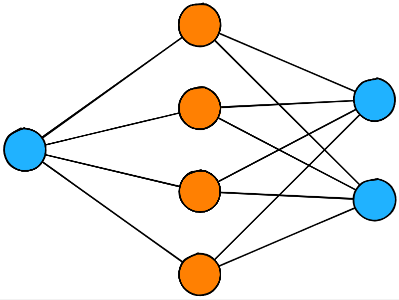

# Neural Network Visualizer

This is a React component for generating Neural Network visualizations.



[Live demo](https://thekevinscott.github.io/neural-network-visualizer/)

## Install

```
yarn add neural-network-visualizer
```

## Quick Start

```
import React from 'react';
import ReactDOM from 'react-dom';
import NNVisualizer from 'neural-network-visualizer';

ReactDOM.render(<NNVisualizer
  width={800}
  height={600}
  network={{
    layers: [
      {
        units: 3,
      },
      {
        units: 4,
      },
      {
        units: 2,
      },
    ],
  }}
/>, document.body);
```
